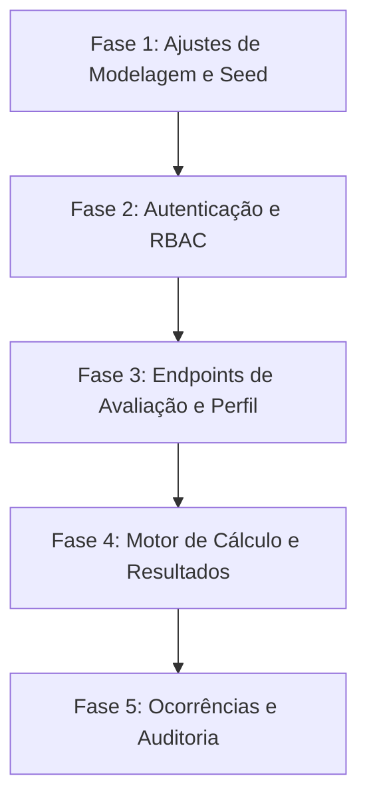

# Plano de Implementação - API Backend IF Literário

Este documento descreve o plano de implementação passo a passo e atômico para o desenvolvimento do backend do **IF Literário**, seguindo os requisitos definidos no [prd.md](file:///c:/Users/caio.duarte/Documents/IF_Literario/specs/prd.md).

O projeto é construído sobre:
- **Node.js (v18+)** com **TypeScript** e **ES Modules** (importações locais devem usar a extensão `.js`).
- **Express.js** como framework HTTP.
- **Prisma ORM** com banco de dados **PostgreSQL** (hospedado no Supabase).
- **Supabase Auth** para autenticação via JSON Web Tokens (JWT).

---

## 📅 Visão Geral das Fases de Desenvolvimento



---

## 🛠️ Fase 1: Ajustes de Modelagem no Banco de Dados (Prisma) e Seed

### 📝 Tarefa 1.1: Criar Modelos `Alocacao` e `LogAuditoria` no `schema.prisma`
- **Objetivo:** Permitir a pré-alocação de avaliadores a turmas (M-N) e criar a tabela para registros de logs de auditoria.
- **Contexto:** O PRD exige que avaliadores submetam notas **exclusivamente** para as turmas às quais foram alocados, e exige logs para operações destrutivas ou recálculos.
- **Arquivos a Modificar:**
  - [schema.prisma](file:///c:/Users/caio.duarte/Documents/IF_Literario/api/prisma/schema.prisma)
- **Instruções de Implementação:**
  1. No `schema.prisma`, adicione o modelo `Alocacao`:
     ```prisma
     model Alocacao {
       id          String   @id @default(uuid())
       avaliadorId String
       turmaId     String
       createdAt   DateTime @default(now())

       avaliador   User     @relation("AvaliadorAlocacoes", fields: [avaliadorId], references: [id], onDelete: Cascade)
       turma       Turma    @relation("TurmaAlocacoes", fields: [turmaId], references: [id], onDelete: Cascade)

       @@unique([avaliadorId, turmaId])
       @@map("alocacoes")
     }
     ```
  2. Adicione as relações inversas nos modelos existentes:
     - No modelo `User`:
       ```prisma
       alocacoes Alocacao[] @relation("AvaliadorAlocacoes")
       logsAuditoria LogAuditoria[]
       ```
     - No modelo `Turma`:
       ```prisma
       alocacoes Alocacao[] @relation("TurmaAlocacoes")
       ```
  3. Adicione o modelo `LogAuditoria` para auditorias:
     ```prisma
     model LogAuditoria {
       id        String   @id @default(uuid())
       usuarioId String?
       acao      String   // Ex: "CRIAR_AVALIACAO", "EXCLUIR_AVALIACAO", "RECALCULO_NOTA"
       detalhes  String   // JSON string contendo o payload ou estado anterior
       timestamp DateTime @default(now())

       usuario   User?    @relation(fields: [usuarioId], references: [id], onDelete: SetNull)
       @@map("logs_auditoria")
     }
     ```
- **Critérios de Sucesso:**
  - O comando `npx prisma validate` deve rodar sem erros.
  - A geração do cliente prisma `npx prisma generate` deve ser concluída com sucesso.

---

### 📝 Tarefa 1.2: Atualizar Script de Seed com Dados de Teste
- **Objetivo:** Adicionar usuários simulados (com diferentes papéis), templates para orientadores e criar alocações de teste no banco.
- **Contexto:** Precisamos de dados para testar as validações de alocação de turmas dos avaliadores visitantes e a nota de orientador.
- **Arquivos a Modificar:**
  - [seed.ts](file:///c:/Users/caio.duarte/Documents/IF_Literario/api/prisma/seed.ts)
- **Instruções de Implementação:**
  1. Crie usuários de teste para cada papel:
     - `ADMIN`: Administrador geral.
     - `AVALIADOR`: Pelo menos 3 avaliadores para simular a regra de limite de avaliações.
     - `ORIENTADOR`: Pelo menos 1 orientador para as turmas criadas.
  2. Associe as turmas criadas no seed ao `orientadorId` correto.
  3. Adicione um `TemplateAvaliacao` específico para o Orientador (ex: "Ficha do Orientador"), contendo seus respectivos critérios (ex: um critério numérico "Nota Geral" com peso máximo 10).
  4. Crie registros de `Alocacao` vinculando os avaliadores de teste às turmas simuladas.
- **Critérios de Sucesso:**
  - O comando `npx prisma db seed` deve rodar com sucesso.
  - O banco de dados deve refletir as novas tabelas (`alocacoes`, `logs_auditoria`) e dados semeados.

---

## 🛡️ Fase 2: Autenticação, Enriquecimento de Contexto e RBAC

### 📝 Tarefa 2.1: Enriquecer Middleware `requireAuth`
- **Objetivo:** Buscar os dados do usuário correspondente no banco de dados local (`users`) e anexar ao contexto da requisição (`req.user`) com a `role` correta.
- **Contexto:** Atualmente o middleware apenas valida o token com o Supabase Auth e retorna os metadados brutos do Supabase. Precisamos do perfil interno (contendo a Role) para controle de acesso.
- **Arquivos a Modificar:**
  - [auth.ts](file:///c:/Users/caio.duarte/Documents/IF_Literario/api/src/middlewares/auth.ts)
- **Instruções de Implementação:**
  1. No middleware `requireAuth`, após validar o token no Supabase (`supabase.auth.getUser(token)`):
     - Busque o usuário no banco de dados local com Prisma:
       ```typescript
       const dbUser = await prisma.user.findUnique({
         where: { id: data.user.id }
       });
       ```
     - Se o usuário não existir localmente, retorne status `401` com `{ error: 'Usuário não cadastrado no banco do sistema' }`.
     - Atribua o usuário do banco a `req.user`:
       ```typescript
       req.user = dbUser;
       ```
  2. Atualize a tipagem de `AuthRequest` para refletir o formato do modelo de usuário do Prisma.
- **Critérios de Sucesso:**
  - Fazer requisição para `/api/perfil` com um token válido e receber os dados do usuário registrados no banco local (incluindo `role`).

---

### 📝 Tarefa 2.2: Criar Middleware de Autorização Baseada em Papéis (RBAC)
- **Objetivo:** Bloquear o acesso a rotas específicas com base na role do usuário autenticado.
- **Contexto:** Admin, Avaliador e Orientador possuem níveis de permissão diferentes especificados no PRD.
- **Arquivos a Criar:**
  - [roles.ts](file:///c:/Users/caio.duarte/Documents/IF_Literario/api/src/middlewares/roles.ts)
- **Instruções de Implementação:**
  1. Crie um middleware de fábrica `requireRole(allowedRoles: Role[])`:
     ```typescript
     import { Response, NextFunction } from 'express';
     import { AuthRequest } from './auth.js';
     import { Role } from '@prisma/client';

     export const requireRole = (allowedRoles: Role[]) => {
       return (req: AuthRequest, res: Response, next: NextFunction) => {
         if (!req.user) {
           return res.status(401).json({ error: 'Não autorizado' });
         }
         if (!allowedRoles.includes(req.user.role)) {
           return res.status(403).json({ error: 'Acesso proibido: permissão insuficiente' });
         }
         next();
       };
     };
     ```
- **Critérios de Sucesso:**
  - Rotas protegidas com `requireRole(['ADMIN'])` devem bloquear usuários com role `AVALIADOR` ou `ORIENTADOR` com erro `403`.

---

## 📋 Fase 3: Endpoints Principais de Perfil e Avaliação

### 📝 Tarefa 3.1: Implementar Endpoint `GET /api/me`
- **Objetivo:** Retornar os dados do usuário autenticado e a lista de turmas associadas a ele com base no seu papel.
- **Contexto:**
  - **Avaliador:** Retorna turmas onde ele está pré-alocado (via tabela `Alocacao`).
  - **Orientador:** Retorna turmas onde ele é o orientador (`orientadorId === user.id`).
  - **Administrador:** Retorna todas as turmas do evento.
- **Arquivos a Modificar:**
  - [server.ts](file:///c:/Users/caio.duarte/Documents/IF_Literario/api/src/server.ts)
- **Instruções de Implementação:**
  1. Crie a rota `GET /api/me` protegida por `requireAuth`.
  2. Implemente a lógica condicional por papel:
     - Se `req.user.role === 'AVALIADOR'`: Busque turmas em `Alocacao` onde `avaliadorId === req.user.id`.
     - Se `req.user.role === 'ORIENTADOR'`: Busque turmas em `Turma` onde `orientadorId === req.user.id`.
     - Se `req.user.role === 'ADMIN'`: Busque todas as turmas da edição ativa.
  3. Retorne `{ user: req.user, turmas: [...] }`.
- **Critérios de Sucesso:**
  - Chamar `/api/me` com um token de Avaliador retorna apenas suas turmas alocadas.
  - Chamar `/api/me` com token de Orientador retorna apenas a turma que orienta.

---

### 📝 Tarefa 3.2: Implementar Endpoint `GET /api/avaliacoes/turma/:id`
- **Objetivo:** Mostrar o status das submissões de uma turma específica (quantas avaliações foram concluídas e se o orientador já enviou a nota).
- **Contexto:** O frontend precisa dessa rota para exibir o progresso (ex: "2/3 preenchidos").
- **Arquivos a Modificar:**
  - [server.ts](file:///c:/Users/caio.duarte/Documents/IF_Literario/api/src/server.ts)
- **Instruções de Implementação:**
  1. Registre `GET /api/avaliacoes/turma/:id` com proteção `requireAuth`.
  2. Consulte a tabela `Avaliacao` para a turma especificada:
     - Conte as avaliações vindas de usuários com `role === 'AVALIADOR'`.
     - Verifique se existe uma avaliação vinda de usuário com `role === 'ORIENTADOR'` (ou se o template de orientador foi preenchido).
  3. Retorne um JSON resumido:
     ```json
     {
       "turmaId": "uuid",
       "avaliadoresVisitantesConcluidos": X,
       "totalEsperadoAvaliadores": 3,
       "orientadorSubmetido": true | false
     }
     ```
- **Critérios de Sucesso:**
  - O endpoint retorna a contagem exata das submissões já salvas no banco de dados para a turma informada.

---

### 📝 Tarefa 3.3: Implementar Endpoint Transacional `POST /api/avaliacoes`
- **Objetivo:** Receber, validar rigorosamente e persistir uma avaliação e suas notas em bloco (transação ACID), com suporte a idempotência.
- **Contexto:** Trata-se do coração do sistema. Se a conexão falhar ou houver cliques duplos, o sistema deve resistir e não gerar dados duplicados ou parciais.
- **Arquivos a Modificar:**
  - [server.ts](file:///c:/Users/caio.duarte/Documents/IF_Literario/api/src/server.ts)
- **Instruções de Implementação:**
  1. Proteja a rota com `requireAuth`.
  2. **Idempotência (Resiliência):**
     - Verifique antes de processar se já existe registro em `Avaliacao` para a combinação `[turmaId, avaliadorId]`.
     - Se sim, retorne com status `200` e a avaliação existente com a mensagem: `"Avaliação já cadastrada anteriormente"`.
  3. **Validações de Regra de Negócio (Antes de Salvar):**
     - **Para Avaliadores Visitantes:**
       - Garanta que o avaliador está alocado à turma (`Alocacao`).
       - Garanta que ele não submeteu mais que 3 avaliações no total do evento.
       - Garanta que a turma não possui mais que 3 avaliações finalizadas por avaliadores visitantes.
     - **Para Orientadores:**
       - Garanta que o orientador orienta a turma alvo (`turma.orientadorId === req.user.id`).
  4. **Validação de Critérios e Notas:**
     - Busque todos os critérios do template indicado no banco de dados.
     - Valide se o payload de notas contém exatamente todos os critérios definidos no template (não permitir submissão parcial!).
     - Para critérios do tipo `NUMERICO`, valide se `valorNumerico` está presente e se está no intervalo de `0` até `pesoMaximo`.
     - Para `BOOLEANO` ou `TEXTO`, valide a presença e o tipo do respectivo valor.
  5. **Operação ACID (Transação):**
     - Use `prisma.$transaction(...)` para salvar a avaliação:
       - Salve o registro de `Avaliacao`.
       - Crie os múltiplos registros de `NotaCriterio` vinculados.
       - Registre um log na tabela `LogAuditoria` informando o cadastro da avaliação.
- **Critérios de Sucesso:**
  - Tentativas de enviar notas com peso fora do limite são rejeitadas.
  - Cliques múltiplos no mesmo formulário retornam com sucesso (200) na segunda tentativa, sem duplicar registros.
  - Falha na inserção de qualquer critério causa rollback total, sem salvar avaliação sem notas.

---

## 🏆 Fase 4: Motor de Cálculo de Notas e Resultados

### 📝 Tarefa 4.1: Endpoint da Turma Campeã (`GET /api/resultados/campea`)
- **Objetivo:** Gerar o ranking em tempo real do evento baseado na média simples das avaliações visitantes.
- **Contexto:** Apuração imediata do evento com base exclusivamente nas notas de avaliadores de fora.
- **Arquivos a Modificar:**
  - [server.ts](file:///c:/Users/caio.duarte/Documents/IF_Literario/api/src/server.ts)
- **Instruções de Implementação:**
  1. Registre o endpoint `GET /api/resultados/campea` (acessível a todos ou restrito por `requireAuth`).
  2. Busque todas as turmas que possuem avaliações finalizadas por avaliadores visitantes (`role === 'AVALIADOR'`).
  3. Para cada turma, calcule a pontuação total de cada avaliação realizada (soma de todos os critérios numéricos).
  4. Calcule a média simples entre as avaliações visitantes concluídas.
  5. Ordene as turmas em ordem decrescente de nota média.
  6. Retorne o array contendo a turma, a nota final média de visitantes e a quantidade de fichas computadas.
- **Critérios de Sucesso:**
  - O ranking reflete o cálculo exato e ordena corretamente as turmas de maior média para menor.

---

### 📝 Tarefa 4.2: Endpoint de Notas Consolidadas (`GET /api/resultados/consolidado`)
- **Objetivo:** Calcular a nota final escolar de todas as turmas, convertendo e combinando a média de visitantes e a nota de orientador para uma escala de 0 a 100%.
- **Contexto:** Aplicação da fórmula oficial:
  $$Nota Final = \left( \frac{\text{Média Avaliadores (0 a 1)} + \text{Nota Orientador (0 a 1)}}{2} \right) \times 100$$
- **Arquivos a Modificar:**
  - [server.ts](file:///c:/Users/caio.duarte/Documents/IF_Literario/api/src/server.ts)
- **Instruções de Implementação:**
  1. Registre o endpoint `GET /api/resultados/consolidado` com `requireAuth`.
  2. Para cada turma da edição ativa:
     - **Média dos Avaliadores (0 a 1):** Obtenha a média das notas brutas dos visitantes. Divida essa média pela soma do peso máximo de todos os critérios numéricos do template de visitante (ex: 11 critérios de peso 10 = 110 de peso máximo total). O resultado estará na escala de 0 a 1.
     - **Nota do Orientador (0 a 1):** Obtenha a avaliação correspondente à ficha do orientador para aquela turma. Calcule a soma dos critérios numéricos e divida pelo peso máximo total do template de orientador para obter a nota na escala de 0 a 1.
     - **Fórmula:** Aplique a média aritmética entre os dois valores normalizados e multiplique por 100.
     - Trate valores ausentes (se o orientador ou os avaliadores não preencheram, defina como `0` ou trate de acordo com a política do evento).
  3. Ordene a resposta de forma decrescente e retorne com as notas e porcentagens de cada turma.
- **Critérios de Sucesso:**
  - Exemplo de teste:
    - Se a soma dos critérios numéricos do visitante der média de `88/110` (`0.8` normalizado) e a do orientador der `9/10` (`0.9` normalizado).
    - Nota final: `((0.8 + 0.9) / 2) * 100 = 85.0%`.
    - O endpoint deve retornar exatamente o valor esperado.

---

## 🏆 Fase 5: Registro de Ocorrências e Auditoria

### 📝 Tarefa 5.1: Endpoint de Submissão de Ocorrências (`POST /api/ocorrencias`)
- **Objetivo:** Permitir que orientadores registrem ocorrências e incidentes ocorridos nas salas ou no evento.
- **Contexto:** Conforme regra de papéis do PRD, orientadores podem registrar problemas de conduta/infraestrutura.
- **Arquivos a Modificar:**
  - [server.ts](file:///c:/Users/caio.duarte/Documents/IF_Literario/api/src/server.ts)
- **Instruções de Implementação:**
  1. Registre `POST /api/ocorrencias` protegido por `requireAuth` e `requireRole(['ORIENTADOR', 'ADMIN'])`.
  2. Payload esperado: `{ descricao: string, turmaId?: string }`.
  3. Salve a ocorrência na tabela `Ocorrencia` relacionando com `req.user.id` (como `orientadorId`).
  4. Retorne a ocorrência salva com status `201`.
- **Critérios de Sucesso:**
  - Orientadores de teste conseguem submeter ocorrências associadas à sua conta. Avaliadores normais recebem bloqueio 403.

---

### 📝 Tarefa 5.2: Mecanismo de Logs de Auditoria para Operações Críticas
- **Objetivo:** Registrar no banco todas as exclusões ou alterações manuais de notas e avaliações.
- **Contexto:** Garantir integridade e rastreabilidade caso professores questionem recálculos ou alterações de dados.
- **Arquivos a Criar/Modificar:**
  - Crie uma função utilitária `api/src/lib/logger.ts` para facilitar a gravação dos logs:
    ```typescript
    import { PrismaClient } from '@prisma/client';
    // Use a instância compartilhada do prisma ou instancie uma nova se necessário
    ```
  - Sempre que uma ação destrutiva for realizada (ex: exclusão de avaliação por um Admin ou recálculo manual), salve na tabela `LogAuditoria` os detalhes da alteração no formato JSON.
- **Critérios de Sucesso:**
  - Ao simular uma exclusão, uma linha correspondente é inserida na tabela `logs_auditoria`.

---

## 🧪 Plano de Verificação e Testes Manual

Após o término da implementação de cada tarefa, valide os seguintes fluxos:

1. **Validação de Token e Enriquecimento do Usuário:**
   - Faça uma chamada GET para `/api/perfil` com JWT do Supabase. Verifique se o JSON traz a role local do usuário.
2. **Restrições de Submissão (POST):**
   - Tente enviar avaliação para uma turma que o avaliador **não está alocado** -> Deve retornar erro HTTP 400 ou 403.
   - Envie avaliações fictícias até atingir o limite de 3 avaliações para um avaliador -> A quarta tentativa deve retornar erro 400.
   - Simule 3 avaliadores diferentes avaliando a mesma turma -> Um quarto avaliador tentando avaliar a mesma turma deve receber erro 400 (limite da turma atingido).
3. **Verificação de Idempotência:**
   - Faça requisições concorrentes ou repetidas idênticas de submissão para a mesma turma -> A primeira deve dar `201` e a segunda deve dar `200` com a resposta salva, sem criar linhas duplicadas no banco.
4. **Validação do Cálculo Matemático:**
   - Submeta notas exatas de teste e chame `/api/resultados/campea` e `/api/resultados/consolidado` -> Compare o retorno matemático com cálculos feitos manualmente no papel.
